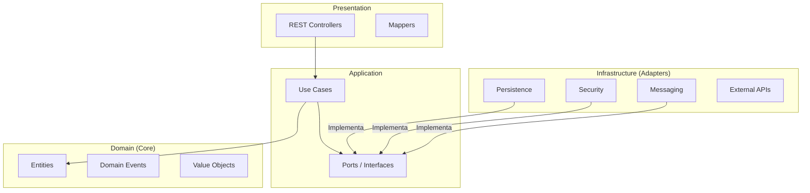
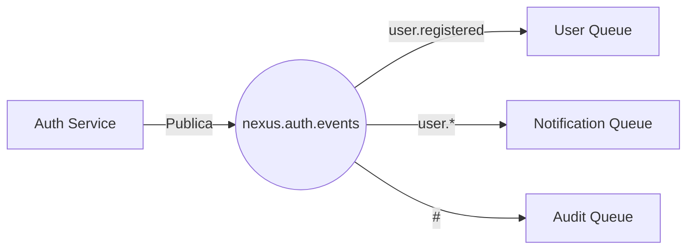
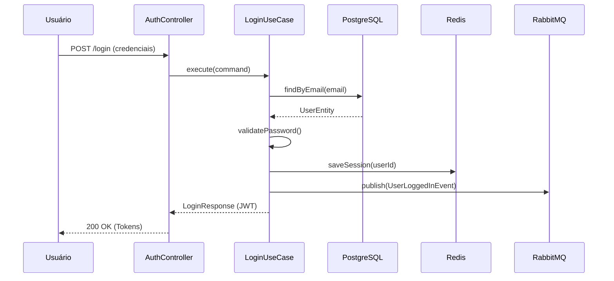

# Nexus Auth Service

[](https://www.oracle.com/java/)
[](https://spring.io/projects/spring-boot)
[](https://www.postgresql.org/)
[](https://redis.io/)
[](https://www.rabbitmq.com/)
[](https://www.docker.com/)

O **Nexus Auth Service** é o microsserviço central de identidade e acesso do ecossistema Nexus ERP. Ele é responsável por gerenciar a autenticação, autorização e o ciclo de vida das sessões de usuários com alta escalabilidade e segurança.

## 1. Visão Geral

O Nexus Auth Service foi projetado para ser o "Single Point of Truth" para identidade em um ambiente de microsserviços distribuídos.

### Responsabilidades
- **Autenticação:** Suporte a login via credenciais (E-mail/Senha) e provedores OAuth2.
- **Autorização:** Controle granular de acesso baseado em Roles (RBAC) e Permissões (PBAC).
- **JWT & Gestão de Sessões:** Emissão e validação de tokens JWT, além de controle de sessões ativas via Redis.
- **Recuperação de Senha:** Fluxo seguro de reset de senha com integração via e-mail.
- **Gestão de Roles e Permissões:** API para administração dinâmica de perfis de acesso.
- **Publicação de Eventos:** Notificação em tempo real de alterações de estado do usuário via RabbitMQ.

## 2. Arquitetura

O projeto utiliza uma combinação de padrões modernos para garantir manutenibilidade, testabilidade e desacoplamento.

### Padrões Aplicados
- **Clean Architecture & Onion Architecture:** Separação clara entre a lógica de negócio central e as preocupações de infraestrutura.
- **DDD (Domain Driven Design):** Foco no domínio do negócio, utilizando entidades ricas e eventos de domínio.
- **Ports & Adapters (Hexagonal Architecture):** Isolamento do núcleo da aplicação através de interfaces (Ports) e implementações externas (Adapters).

### Fluxo de Dependências
As dependências apontam sempre para o centro (Domínio). A infraestrutura depende da aplicação, que depende do domínio.



## 3. Estrutura de Pastas

A estrutura segue rigorosamente os princípios arquiteturais definidos:

```text
src/main/java/com/lkznx7/nexusauth
├── domain          # Núcleo do negócio (Entidades, Enums, Value Objects, Eventos)
├── application     # Regras de negócio da aplicação (Use Cases e Ports)
├── presentation    # Porta de entrada (Controllers, DTOs, Mappers de entrada)
├── infrastructure  # Detalhes técnicos (DB, Segurança, Mensageria, Cache)
└── shared          # Código compartilhado (Configurações, Exceções, Utilitários)
```

## 4. Fluxos Principais

### Login
1.  **Ação:** Usuário envia credenciais via POST `/api/v1/auth/login`.
2.  **Processamento:** Validação de credenciais, verificação de status da conta, criação de sessão no Redis e geração de par Access/Refresh Token.
3.  **Resposta:** Retorno dos tokens e dados básicos do usuário (JWT).

### Validação de JWT
1.  **Ação:** Requisição de outro microsserviço ou Gateway com Header `Authorization: Bearer <token>`.
2.  **Processamento:** Verificação da assinatura, expiração e se o token não foi revogado (check no Redis).
3.  **Resposta:** HTTP 200 (OK) com Claims ou HTTP 401 (Unauthorized).

### Recuperação de Senha
1.  **Ação:** Usuário solicita reset via `/api/v1/auth/forgot-password`.
2.  **Processamento:** Geração de token temporário, publicação de evento de notificação e envio de e-mail.
3.  **Resposta:** Confirmação de envio do link de recuperação.

### Alteração de Role
1.  **Ação:** Administrador altera a Role de um usuário via `/api/v1/users/{id}/role`.
2.  **Processamento:** Atualização no PostgreSQL e publicação do evento `UserRoleChanged`.
3.  **Resposta:** Retorno do usuário com a nova permissão.

### Logout
1.  **Ação:** Usuário solicita saída via `/api/v1/auth/logout`.
2.  **Processamento:** Invalidação do Refresh Token e inclusão do Access Token em Blacklist no Redis.
3.  **Resposta:** HTTP 204 (No Content).

## 5. Eventos de Domínio

O sistema utiliza arquitetura orientada a eventos para notificar outros serviços sobre mudanças críticas.

| Evento | Gatilho |
| :--- | :--- |
| `UserRegistered` | Quando um novo usuário é criado com sucesso. |
| `UserRoleChanged` | Quando o nível de permissão de um usuário é alterado. |
| `UserAccountLocked` | Após sucessivas tentativas de login falhas. |
| `PasswordChanged` | Quando o usuário altera ou recupera sua senha. |
| `UserLoggedOut` | Quando uma sessão é encerrada explicitamente. |

## 6. RabbitMQ

A mensageria é utilizada para comunicação assíncrona e desacoplamento.

- **Exchange Principal:** `nexus.auth.events` (Type: Topic)
- **Fluxo:** O serviço publica eventos na Exchange, que os roteia para filas específicas baseadas em Routing Keys.



## 7. Consumidores

Outros microsserviços reagem aos eventos do Auth Service:

- **User Service:** Sincroniza dados básicos de perfil e preferências.
- **Notification Service:** Dispara e-mails de boas-vindas, alertas de segurança e links de recuperação.
- **Audit Service:** Registra o histórico de acessos e alterações críticas para conformidade (LGPD/GDPR).

## 8. Banco de Dados

### PostgreSQL (Relacional)
Armazena dados que exigem consistência e relacionamentos complexos:
- **Users:** Dados cadastrais e credenciais.
- **Roles:** Perfis de acesso (Ex: ADMIN, USER).
- **Permissions:** Permissões granulares (Ex: READ_USER, WRITE_AUTH).
- **Sessions:** Metadados de sessões históricas.

### Redis (NoSQL / Cache)
Armazena dados de alta performance e voláteis:
- **Cache de Sessões:** Sessões ativas para validação ultra-rápida.
- **Blacklist de Tokens:** Tokens revogados antes da expiração.
- **Rate Limiting:** Controle de tentativas de login por IP/Usuário.

## 9. Segurança

- **JWT (JSON Web Token):** Utilizado para autenticação stateless entre serviços.
- **OAuth2:** Integração com Google/Github e suporte a fluxos de delegação de acesso.
- **Refresh Tokens:** Estratégia para manter o usuário logado com segurança, minimizando a exposição do Access Token.
- **RBAC & PBAC:** Verificação de hierarquia (Roles) e ações específicas (Permissions) em cada endpoint.

## 10. Tecnologias Utilizadas

- **Linguagem:** Java 21
- **Framework:** Spring Boot 3.3
- **Segurança:** Spring Security
- **Dados:** Spring Data JPA, Hibernate
- **Banco de Dados:** PostgreSQL, Redis
- **Mensageria:** RabbitMQ
- **Migrations:** Flyway
- **Documentação:** OpenAPI 3 / Swagger
- **Infraestrutura:** Docker, Docker Compose
- **Testes:** JUnit 5, Testcontainers

## 11. Roadmap

- **Fase 1: Monólito Modular** - Estruturação interna limpa e core de autenticação.
- **Fase 2: Mensageria RabbitMQ** - Integração com barramento de eventos.
- **Fase 3: Microsserviços** - Separação completa e deploy distribuído.
- **Fase 4: Observabilidade** - Implementação de logs centralizados e tracing (Jaeger/Zipkin).
- **Fase 5: Escalabilidade Horizontal** - Auto-scaling e balanceamento de carga avançado.

## 12. Diagrama de Fluxo (Login)



## 13. Princípios Arquiteturais

- **Dependency Inversion (DIP):** O núcleo não depende da infraestrutura; a infraestrutura se acopla ao núcleo através de interfaces.
- **Single Responsibility (SRP):** Cada componente tem uma única razão para mudar.
- **Open/Closed (OCP):** Aberto para extensão (novos provedores OAuth2), fechado para modificação.
- **Domain Driven Design (DDD):** Linguagem ubíqua e foco total no domínio de autenticação.
- **Event Driven Architecture (EDA):** Reação a eventos para garantir consistência eventual em sistemas distribuídos.

---
Desenvolvido por [lkznx7](https://github.com/lkznx7) como parte do ecossistema Nexus ERP.
